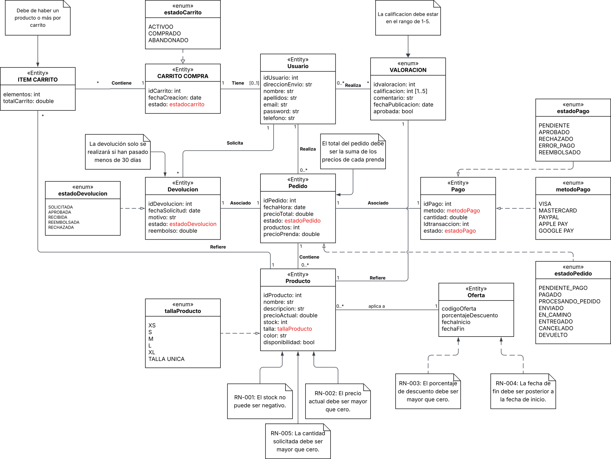

# Tienda de ropa en línea KUMAFU

## Miembros del grupo L1-DF-AM-1 (2026)

1. Moguel Prado, José
2. Lázaro Marín, Rubén
3. Apellidos, Nombre
4. Apellidos, Nombre

## 1. Introducción al problema

Este proyecto tiene como objetivo diseñar y desarrollar el sistema de información de KUMAFU, una tienda en línea especializada en la venta de ropa, como sudaderas, camisetas y pantalones. El negocio busca digitalizar y automatizar su proceso de venta y mejorar la interacción con los proveedores, encargados de abastecer el inventario, y con los clientes, que utilizarán una interfaz web.

La tienda contará con:

1. Proveedores externos que suministrarán los productos.
2. Una interfaz para realizar pedidos.
3. Opciones para solicitar devoluciones y enviar valoraciones.

### Situación actual y problemas detectados

El principal problema de la gestión actual de la tienda son los cuellos de botella operativos, que dificultan su crecimiento y escalabilidad.

1. **Falta de trazabilidad de las ventas:** No hay un proceso claro para hacer seguimiento de las compras. Los clientes tampoco disponen de un carrito persistente que conserve su estado (activo, abandonado o convertido en pedido).
2. **Gestión manual de pagos y estados:** El procesamiento de los pagos y el seguimiento de los pedidos (desde el pago pendiente hasta la entrega o devolución) carecen de automatización y de trazabilidad financiera.
3. **Gestión ineficiente de las devoluciones:** El proceso no está definido con suficiente claridad, lo que puede generar conflictos con los plazos y disputas sobre los reembolsos.
4. **Falta de valoraciones:** La tienda no dispone de un sistema integrado para conocer la satisfacción de los clientes con los productos adquiridos.

### Expectativas y solución propuesta

Para resolver estas carencias, se desarrollará un sistema integral que cubra el ciclo de vida de la compra. La solución incluirá:

- **Gestión de usuarios y catálogo:** Los usuarios registrados podrán consultar un catálogo de productos con tallas (de XS a XL y talla única) y colores disponibles. El sistema controlará el stock de cada producto.
- **Proceso de compra:** El sistema ofrecerá un carrito temporal que podrá convertirse en un pedido. También registrará los pagos y permitirá utilizar distintos métodos, como Visa, Mastercard, PayPal, Apple Pay y Google Pay.
- **Gestión de devoluciones:** Habrá un módulo para solicitar devoluciones y gestionar reembolsos. Las solicitudes podrán realizarse durante los 30 días posteriores a la compra.
- **Valoraciones y ofertas:** Los usuarios podrán valorar los productos del 1 al 5 y dejar un comentario. Además, el sistema ofrecerá promociones temporales con descuentos aplicados al precio de los productos.

## 2. Glosario de términos

Este glosario recoge los términos del dominio de KUMAFU necesarios para comprender la lógica del negocio y las entidades del modelo:

- **Carrito de compra:** Contenedor temporal que agrupa los productos que un usuario desea adquirir. Puede estar activo, abandonado o convertido en un pedido.
- **Devolución:** Proceso iniciado por el usuario para devolver un pedido y solicitar un reembolso. La solicitud debe realizarse durante los 30 días posteriores a la compra.
- **Ítem de carrito:** Línea del carrito que indica un producto y la cantidad que el usuario desea adquirir. Todo carrito debe contener al menos un ítem.
- **Oferta:** Promoción con fechas de inicio y fin que aplica un descuento superior a cero a determinados productos del catálogo.
- **Pago:** Transacción económica asociada a un pedido. Incluye un identificador de transacción y se realiza mediante alguno de los métodos de pago admitidos.
- **Pedido:** Registro que confirma la intención de compra del usuario. Agrupa los productos seleccionados y calcula el total a partir de sus precios en el momento de la compra.
- **Producto o prenda:** Artículo de ropa que vende KUMAFU. Tiene una talla de XS a XL o talla única, un color, un precio actual y una cantidad disponible en el almacén, que no puede ser negativa.

- **Valoración:** Opinión de un usuario sobre un producto adquirido, compuesta por una puntuación del 1 al 5 y un comentario. Debe aprobarse antes de hacerse pública.

## 3. Visión general del sistema

### 3.1. Requisitos generales

### 3.2. Usuarios del sistema

## 4. Catálogo de requisitos

### 4.1. Requisitos funcionales

#### R.F.01. Título del requisito funcional

- **Como:** [tipo de usuario]
- **Quiero:** [servicio]
- **Para:** [razón]

**Pruebas de aceptación**

- Descripción de la primera comprobación que se debe realizar.
- Descripción de la segunda comprobación que se debe realizar.
- Se debe cumplir la regla de negocio R.N.XX.

#### 4.1.1. Requisitos de información

##### R.I.01. Título del requisito de información

- **Como:** [tipo de usuario]
- **Quiero:** [servicio]
- **Para:** [razón]

**Pruebas de aceptación**

- Descripción de la primera comprobación que se debe realizar.
- Descripción de la segunda comprobación que se debe realizar.

#### 4.1.2. Reglas de negocio

##### R.N.01. Título de la regla de negocio

Descripción de la regla de negocio.

### 4.2. Mapa de historias de usuario (opcional)

### 4.3. Requisitos no funcionales (opcional)

**R.N.F.01. Título del requisito no funcional**

- **Como:** [tipo de usuario]
- **Quiero:** [servicio]
- **Para:** [razón]

---

## 5. Modelo conceptual

### 5.1. Diagramas de clases UML

### 5.2. Escenarios de prueba

Cada escenario debe incluir una descripción textual y un diagrama de objetos UML.

## 6. Matrices de trazabilidad

Matriz de trazabilidad entre los elementos del modelo conceptual y los requisitos:

|         | Entidad X | Asociación X | Restricción X | Entidad 2... |
|:--------|:----------|:-------------|:--------------|:--------------|
| RI-1    | X         | X            | X             | X             |
| RI-2    |           | X            |               | X             |
| RF-1    |           | X            |               | X             |
| RF-2    | X         |              | X             | X             |
| RN-1    |           | X            |               |               |
| RN-2    | X         | X            | X             |               |
| ...     |           |              |               |               |

---

## 7. Modelo relacional en 3FN

Relaciones obtenidas al transformar el modelo conceptual.

### 7.1. Justificación de la estrategia de transformación de jerarquías

Si se identificaron jerarquías en el modelo conceptual, se debe justificar la estrategia utilizada para transformarlas.

## 8. Matriz de trazabilidad entre el modelo conceptual y SQL (opcional)

La matriz debe relacionar las restricciones del modelo conceptual con los elementos del modelo tecnológico en SQL, como disparadores y restricciones declarativas. Para el entregable 3, se deben incluir las reglas de negocio y su implementación mediante restricciones o disparadores.

|             | Entidad X | Asociación X | Restricción X | Entidad 2... |
|:------------|:----------|:-------------|:--------------|:--------------|
| TABLA-1     |           |              |               |               |
| TABLA-2     |           |              |               |               |
| TABLA-3     |           |              |               |               |
| TABLA-4     |           |              |               |               |
| TRIG-1      |           |              |               |               |
| TRIG-2      | X         | X            |               | X             |
| TRIG-3      |           | X            |               | X             |
| TRIG-4      |           |              | X             |               |
| CONST-1     |           |              |               |               |
| CONST-2     | X         | X            |               | X             |
| CONST-3     |           | X            |               | X             |
| CONST-4     |           |              | X             |               |

Se consideran todos los tipos de restricciones declarativas, es decir, las definidas en las instrucciones `CREATE TABLE`.

---

## Referencias
